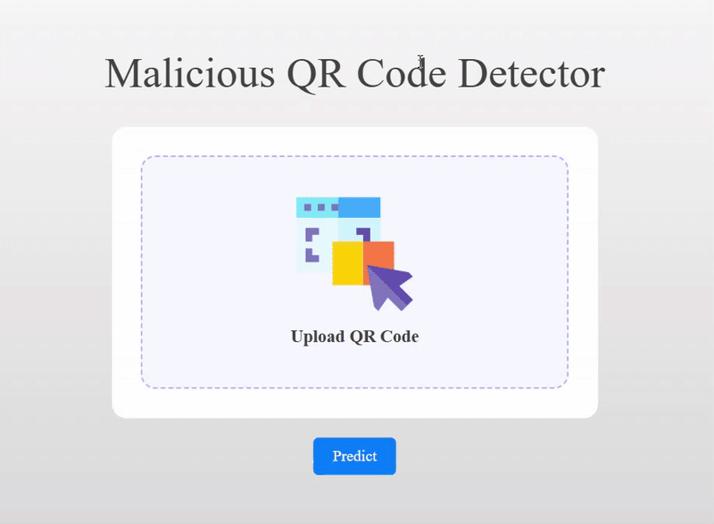

# 📲 **Malicious URL Detection in QR Codes** 🔍

---

## 🌟 **Project Overview** 

This project unveils a **Malicious QR Code Detector** designed to evaluate QR code safety.  
**How it works**: The system extracts the URL embedded in a QR code and employs an **Artificial Neural Network (ANN)** to classify it as:  
- **Safe**  
- **Unsafe**  

By analyzing URLs, it protects users from threats like **phishing**, **malware**, and other risks linked to malicious QR codes.  
**Data Collection**: The dataset, sourced from Kaggle, includes **654,132 URLs**—originally split as **70% safe** (~457,892) and **30% malicious** (~196,240). Downsampling balanced it to a **50/50 ratio**, enhancing ANN accuracy and fairness.  
**Goal**: Provide a reliable, efficient tool to address risks in today’s QR code-driven digital world.

---

## 🎥 **Project Demo**  



---

## 🚀 **How to Run**

1. 📥 Clone the repository:  
   ```bash
   git clone https://github.com/fiftybucks101/Malicious_QR_Code_Detection.git

2. 🔧 Install dependencies:
    ```bash
    pip install -r requirements.txt

3. ▶️ Run the application 
    ```bash
    python app.py

---
## **DVC Commands**

1. 🌱 Initialize Git:
    ```bash
    git init 

2. 🛠️ Initialize DVC:
    ```bash
    dvc init

3. 🔄 Reproduce/Run the pipeline:
    ```bash
    dvc repro

4. 📊 View metrics:
    ```bash
    dvc metrics show

5. 🔍 Visualize pipeline:
    ```bash
    dvc dag

---

## ☁️ **MLOps Implementation**  
⚙️ The project integrates a robust MLOps workflow using the following tools:  
- **DVC**: For data and model versioning.  
- **AWS**: For scalable cloud storage of datasets and artifacts.  
- **Docker**: For containerizing the application in consistent environments.  
- **CI/CD**: For automating testing and deployment pipelines.  
- **MongoDB**: For storing and managing data as the project’s database.

---

## 🗂️ **Project Workflows**

1. Update config.yaml
2. Update params.yaml
3. Update config entity
4. Update configuration manager in src config
5. Update Components
6. Update stages pipeline
7. Update DVC pipeline
8. Update app.py